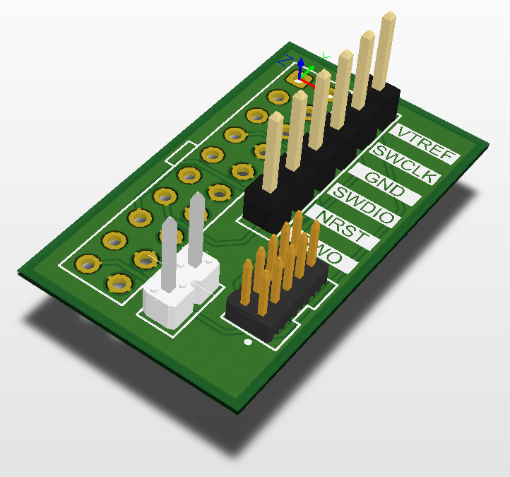

# ARM SWD 20-pin Adapter

This board makes connection between different types of ARM debug connectors:

- ARM standard 20-pin header 2.54 mm pitch
- Cortex-M Debug 10-pin connector 1.27 mm pitch
- Nucleo board 6-pin connector 2.54 mm pitch

Solder a 20-pin female header and put on ST-Link V2 programmer/debugger like a hat.

## PCB

Board dimensions: 29 x 17 mm.

Layers: 2.

Through-hole pads (only 2.54mm pitch pin headers) are aligned to 2.54 mm grid (100 mil).

## Schematic

The schematic is available [here](Production/PDF/BB_ARM_SWD.PDF).

## Production Files

The Gerber & NC Drill files are prepared for production at JLCPCB factory. You should choose "Single PCB" option when ordering.
