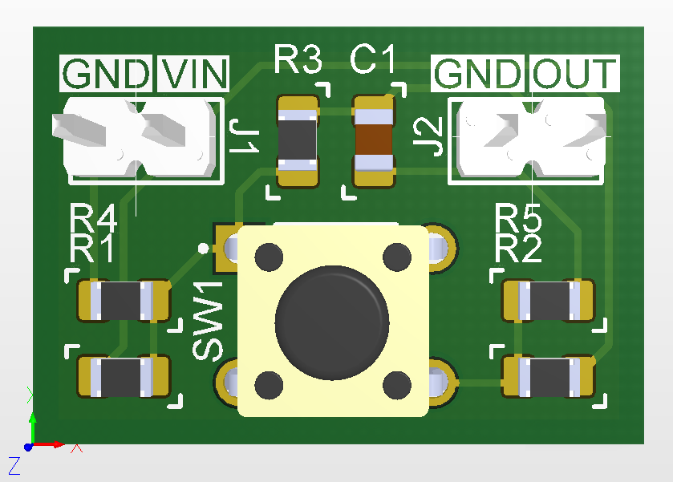

# Breakout board for a tactile button

Button outline: 6x6 mm, through-hole. 

## PCB

Board dimensions: 20.5 x 14 mm.

Layers: 2.

Through-hole pads (pin headers) are aligned to 2.54 mm grid (100 mil).

## Schematic

The schematic is available [here](Production/PDF/BB_BTN_TACT.PDF).

Use 0 Ohm resistors (R4/R1/R5/R2) to adjust the circuit for your suitable case: output signal is active low or active high.

## Production Files

The Gerber & NC Drill files are prepared for production at JLCPCB factory. You should choose "Single PCB" option when ordering.

