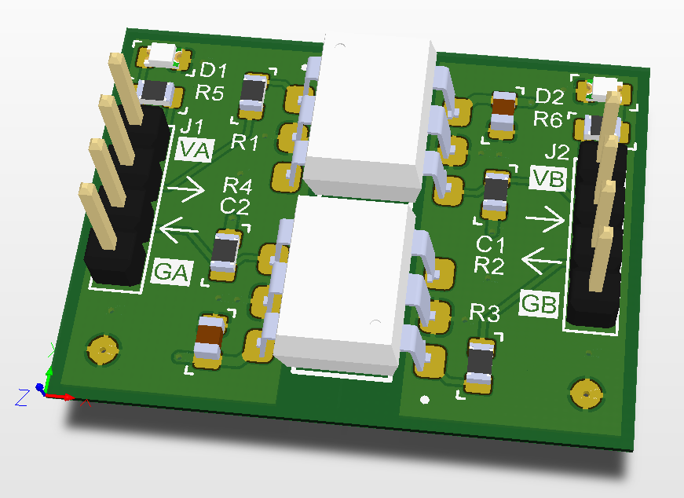

# Optocoupler board for UART interface

The board is designed to isolate UART interfaces of two circuits using Schmitt Trigger Output Optocoupler with 1 MHz bandwidth. VA/GA and VB/GB form the pairs of VCC/GND of isolated circuits. The direction of signal is marked with arrow.

Besides the primary purpose of this board, it can be used for different applications: relay control, voltage-level converter, zero-cross detection, etc.

Part: H11L1SR2M (Fairchild/ONSemi).

## PCB

Board dimensions: 30.5 x 23 mm.

Layers: 2.

Through-hole pads (pin headers) are aligned to 2.54 mm grid (100 mil).

## Schematic

The schematic is available [here](Production/PDF/BB_H11L1_TXRX.PDF).

## Production Files

The Gerber & NC Drill files are prepared for production at JLCPCB factory. You should choose "Single PCB" option when ordering.

