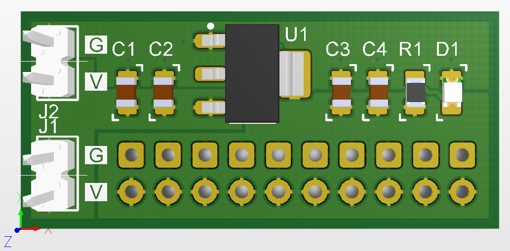

# Breakout board for LM1117-compatible voltage regulator

The board suits LM1117-compatible voltage regulator in SOT-223 package with fixed output voltage, e.g. AMS1117, etc.

The output voltage is routed to 20-pin header (not presented on the preview), which allows to power up to 10 external circuits. The board can be easily chained with each other using the coupled VIN pin headers.

## PCB

Board dimensions: 33 x 15 mm.

Layers: 2.

Through-hole pads (pin headers) are aligned to 2.54 mm grid (100 mil).

## Schematic

The schematic is available [here](Production/PDF/BB_LM1117_VREG.PDF).

## Production Files

The Gerber & NC Drill files are prepared for production at JLCPCB factory. You should choose "Single PCB" option when ordering.

