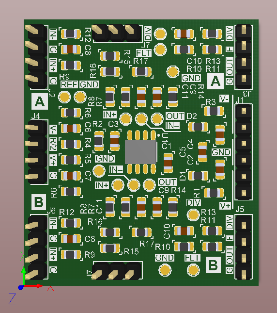

# Breakout board for LM358-compatible operational amplifier

This design allows to build the following typical applications:
- inverting amplifier;
- non-inverting amplifier (analog buffer);
- difference (differential) amplifier.

This board is compatible with operational amplifiers which has the same pinout as LM358 in SOIC-8 package, e.g. MCP6002, etc., and operate with both unipolar and bipolar power supply.

## PCB

Board dimensions: 38 x 43 mm.

Layers: 2.

Through-hole pads (pin headers) are aligned to 2.54 mm grid (100 mil).

## Schematic

The schematic is available [here](Production/PDF/BB_OPAMP.PDF).

The project consists of top-level schematic (`Breakout.SchDoc`) and two prototype circuits for each channel (`Analog.SchDoc`), marked on the PCB as "A" and "B" sides. For easier maintaining of same circuits for both channels, the analogue parts are added as sheet symbol to the top-level document.

Note: there are duplicate designators on the PCB. You should distinguish the components on each side of split line going through the center of the PCB (see big font-inverted marks on the silk screen).

## Production Files

The Gerber & NC Drill files are prepared for production at JLCPCB factory. You should choose "Single PCB" option when ordering.

