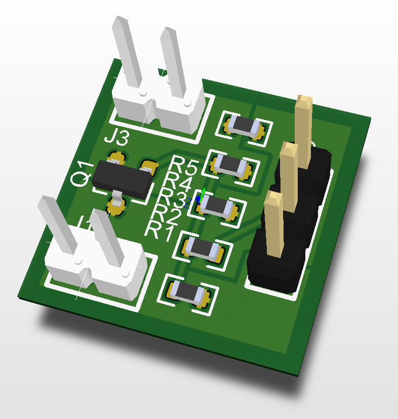
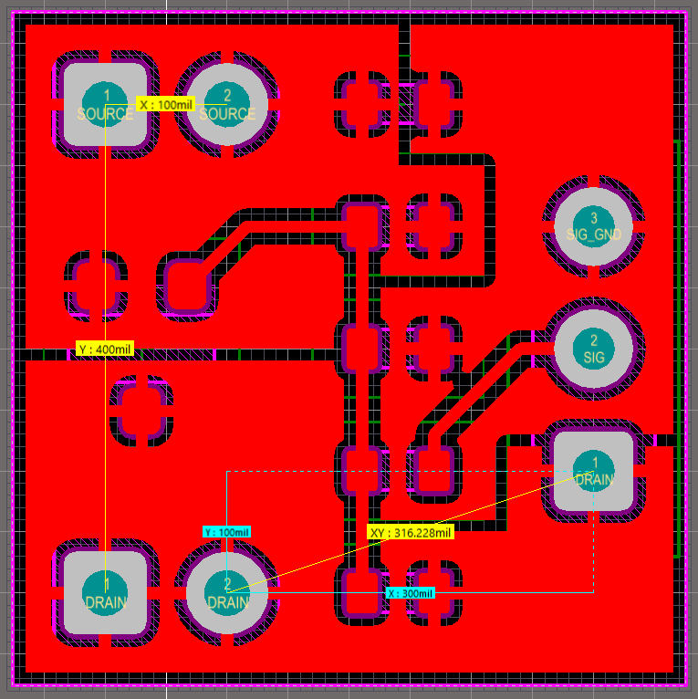
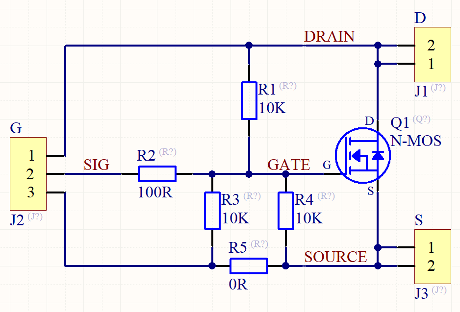

# Breakout board for SOT-23 MOSFETs

You can use this breakout board with N-channel or P-channel MOSFET in SOT-23 package: appropriate connection can be done with SMD resistors. This board is designed to be either easily soldered on prototype PCBs available on eBay, AliExpress, etc., or used separately as module with Arduino, Raspberry Pi, etc.

## PCB

Layers: 2 (no tracks on the bottom layer).

Board dimensions: 15mm x 15mm.

Through-hole pads are aligned to 2.54 mm grid (100 mils).

## Schematic

Appropriate resistors shall be soldered to use this board as low-side (Q1 is N-channel MOSFET) or high-side (Q1 is P-channel) switch module. You can make your own suitable configuration. Example:

| Solder? | N-MOS | P-MOS |
| :-- | --- | --- |
| R1 | - | Yes |
| R2 | Yes | Yes |
| R3 | - | - |
| R4 | Yes | - |
| R5 | Yes | - |

## Production Files

The Gerber & NC Drill files are prepared for production at JLCPCB factory. You should choose "Single PCB" option when ordering.
 

